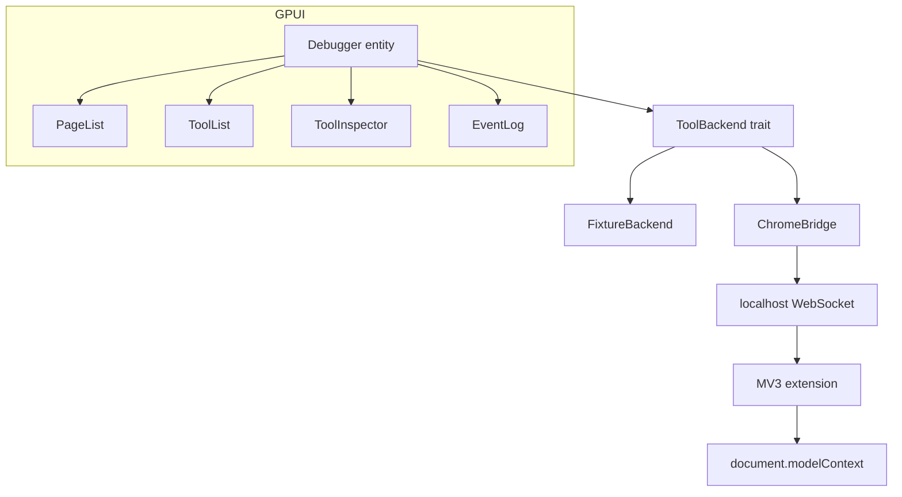
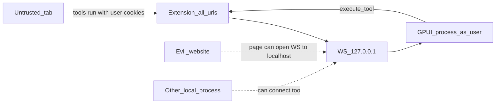

# WebMCP Debugger: GPUI first, Chrome second

Build a native GPUI WebMCP debugger as a developer tool: first a working four-panel UI against an in-process fixture backend, then a Chrome extension bridge so Execute actually invokes tools on a real tab. Stop before LLM, replay, or Sidecar.

## Status

- [x] Phase 1 — GPUI window + fixture backend (browse tools, no execute yet)
- [x] Phase 2 — Primitive JSON Schema form + Execute against fixture
- [x] Phase 3 — Demo site with `get_user`, `search_products`, `create_note`
- [ ] Phase 4 — MV3 extension: `getTools` / `executeTool` / `ontoolchange` → WebSocket on `127.0.0.1` with `chrome-extension` Origin allowlist
- [ ] Phase 5 — ChromeBridge: GPUI lists live tab tools and Execute returns real WebMCP results

## Product

A **native inspector**, not an agent. The first useful app is:

> Open the GPUI window, see pages and tools, fill a schema-generated form, click Execute, see the result and an event log.

Chrome already ships a side-panel inspector ([beaufortfrancois/model-context-tool-inspector](https://github.com/beaufortfrancois/model-context-tool-inspector)). We are not cloning Gemini chat. Our wedge is a **native GPUI surface**, a **stable protocol**, and **recorded executions** that later become timeline/replay. Chrome’s inspector still executes via a JSON textarea (schema-form PR is unmerged); that is the first place we can be better.

WebMCP is experimental (origin trial from Chrome 149, local flag `chrome://flags/#enable-webmcp-testing`, minimum useful Chrome ~150). The API has already moved (`navigator.modelContext` → `document.modelContext`). **GPUI and the protocol never mention `document.modelContext`.**

## Invert the original build order

The write-up said demo-site → extension → Rust → GPUI. That couples UI work to Chrome flags, content-script worlds, and API churn.

You asked for the opposite, which is the right order:

```text
Phase 1  GPUI + fixture backend     (no Chrome)
Phase 2  schema form + Execute      (still fixture)
Phase 3  demo site                  (validate WebMCP itself)
Phase 4  extension + WebSocket      (real tab)
Phase 5  swap fixture for Chrome    (same UI, real round-trip)
```

Stop there. No LLM, no approval gate, no replay, no Sidecar, no native messaging.



The UI only talks to `DebuggerState` plus a `ToolBackend`. Phase 1–2 use `FixtureBackend`. Phase 5 plugs in `ChromeBridge` without rewriting panels.

## Architecture decisions

**1. Shared protocol crate, boring state.** One event model, serde JSON, no event sourcing.

Events (browser → debugger): `hello`, `page_changed`, `tools_changed`, `tool_execution_started`, `tool_execution_finished`, `tool_execution_failed`, `disconnected`.

Commands (debugger → browser): `subscribe_page`, `execute_tool`.

Core types stay close to the write-up (`Page`, `Tool`, `ToolExecution`, `DebuggerState`). Add `annotations` (`readOnlyHint`, `untrustedContentHint`) because Chrome already returns them. Store times as `chrono::DateTime<Utc>` in the protocol and `Instant` only for local duration math.

**2. WebSocket for the MVP, not native messaging.** Native messaging needs a host manifest and is painful to iterate. The GPUI app listens on **`127.0.0.1` only** (fixed port, e.g. `17321`). The extension connects when the app is running. Reject WebSocket `Origin` values that are not `chrome-extension://<our-extension-id>`. Later we can add native messaging behind the same `ToolBackend` trait.

**3. Use Chrome’s real inspector path, not monkey-patching.** Current official `content.js` does this from the content-script world:

- Guard: `document.modelContext` must exist (flag not enabled otherwise).
- List: `await document.modelContext.getTools({ fromOrigins })`
- Watch: `document.modelContext.ontoolchange`
- Execute: find the tool object, then `document.modelContext.executeTool(tool, args)` — **the tool object from `getTools()`, not a name string**.
- Args: prefer a parsed object; fall back to a JSON string if Chrome still rejects it (`Failed to parse input`).
- Result may be `null` when a tool navigates.

Do not wrap `registerTool`. Do not depend on `navigator.modelContextTesting` (older docs; current inspector uses `document.modelContext`).

**4. Schema forms: primitives only.** Object properties of `string` | `number` | `integer` | `boolean`, plus `required`. Anything else (arrays, nested objects, `oneOf`, `enum` beyond a simple select) falls back to a JSON textarea. Full JSON Schema is how this project dies in week one.

**5. Pin GPUI from crates.io.** Current published crate is `gpui` 0.2.2. On macOS also take `gpui_platform` with `font-kit`. Text fields exist as an official example (`crates/gpui/examples/input.rs` in Zed); copy that pattern rather than inventing an editor.

**6. Treat the debugger as a privileged native process.** GPUI does not sandbox us. See the threat model below. Phase 4 must bind `127.0.0.1` only and reject WebSocket clients that are not our extension.

## What GPUI actually gives us (and what it does not)

GPUI is Zed’s GPU UI framework. It draws windows and owns app state. It is **not** a browser, **not** a permission system, and **not** a sandbox.

The debugger binary is a normal macOS process running as you. Anything Rust can do (`std::fs`, TCP, spawning processes, talking to Chrome via the extension) is available whether or not GPUI wraps it. Using GPUI does not reduce that power.

### Platform APIs on `App` we *could* call

From the current `gpui::App` / platform surface ([docs.rs/gpui App](https://docs.rs/gpui/latest/gpui/struct.App.html)):

- **Windows and input:** open/close windows, menus, dock menu, keybindings, focus, drag-and-drop
- **Files:** `prompt_for_paths`, `prompt_for_new_path`, `reveal_path` (Finder), `open_with_system`, recent documents
- **Clipboard:** `read_from_clipboard` / `write_to_clipboard`
- **URLs:** `open_url` (default browser), `on_open_urls` (incoming)
- **OS chrome:** system notifications, app quit/restart
- **Network helper:** `http_client()` / `set_http_client()`
- **Secrets:** platform keychain via `read_credentials` / `write_credentials` / `delete_credentials`
- **Rendering extras:** SVG renderer; optional crate feature `screen-capture` (we will not enable it)
- **Async:** `background_executor`, `foreground_executor`, `spawn` — this is how the WebSocket server will run without blocking the UI

### What the MVP will actually use

Use only:

- One window, entities, lists, text, clicks, a text input for schema fields
- Background executor for the localhost WebSocket
- Optional: copy result JSON to the clipboard (explicit button, not auto)

Do **not** use for MVP: keychain, file dialogs, notifications, `open_url` / `open_with_system` on any string that came from a page, HTTP fetches of tool-result URLs, screen capture, SVG loaded from tool output.

### Can we “find vulnerabilities” in GPUI?

Not as product work, and not as a useful first hunt.

- There are **no public CVEs filed against the `gpui` crate** as a UI toolkit. Published Zed advisories (SSH/WSL env injection, MCP/LSP settings executing commands, agent tool-permission bypasses) are **Zed editor** bugs, not “GPUI lets you XSS the GPU.”
- Classic **web XSS does not apply** to GPUI text: we render strings as glyphs, not HTML. The analogous bugs appear only if **we** later interpret untrusted bytes as SVG, markdown-with-HTML, or pass them to `open_url`.
- SVG/image parsers (`resvg`, image crates) can have memory-safety issues in theory. We avoid the class by not feeding page/tool payloads into those renderers.

Hunting GPUI CVEs is out of scope. Hardening **our** process, socket, and Execute path is in scope.

## Threat model for *this* debugger

The dangerous part is not GPUI. It is **Execute on a live tab** plus a **localhost socket**.

Chrome’s own inspector states it does not implement production security boundaries and should not be used on untrusted sites. We inherit that, then add a network hop they do not have.



**1. Tool execution is the user’s session.** `document.modelContext.executeTool` runs **in the page**. If the tab is GitHub, Gmail, or a bank, a mutating tool is the logged-in user acting. `readOnlyHint` is only a hint. Chrome’s [agent security](https://developer.chrome.com/docs/agents/security) and [tool security](https://developer.chrome.com/docs/ai/webmcp/secure-tools) guidance: assume mutation unless annotated otherwise; treat `untrustedContentHint` output as hostile (prompt injection later; for the inspector, do not treat it as code).

**2. Localhost WebSocket is a new hole.** Any HTTPS page can often open `ws://127.0.0.1:17321`. Without checks, that page could send `execute_tool` and fire tools on whichever tab the extension is attached to. Bind **`127.0.0.1` only** (never `0.0.0.0`). Accept connections whose `Origin` is `chrome-extension://<our-id>`. Reject browser page origins. Optional later: per-launch pairing token (not required to start Phase 1).

**3. Extension permission is maximal.** MV3 with `<all_urls>` can see every tab’s tools, same as the official inspector. That is required for a debugger and is also the whole privilege. README must say: local-dev tool; do not leave it loaded while browsing untrusted sites.

**4. Untrusted strings in the UI.** Tool names, descriptions, schemas, and results come from the page. Render as **plain text**. Do not parse markdown, HTML, or SVG. Do not auto-open links. Show origin of the selected page in the chrome so it is obvious which site you are about to Execute against.

**5. Annotations we already planned to store.** Surface `readOnlyHint` and `untrustedContentHint` in the tool list (badge). For MVP, Execute stays one click (this is a debugger, not an agent). A confirm dialog on non-localhost origins can wait until after Phase 5.

Phase 1–2 (fixture only) have almost no of this surface: no socket, no Chrome, fake JSON.

## Repo layout

```text
gpuiXwebmcp/
  Cargo.toml                 workspace
  crates/protocol/           serde types + JSON protocol
  crates/debugger/           GPUI app + FixtureBackend + WS server
  extension/                 MV3: background, content, no UI
  demo-site/                 vanilla HTML/JS, 3 tools
  plan/                      this document
```

Vanilla demo site (no bundler). Localhost is a secure context, which WebMCP requires.

Demo tools must match the fixture so Phase 5 is a backend swap, not a product change:

- `get_user` — no required args, returns a fake profile
- `search_products` — `{ query: string }`, returns two books
- `create_note` — `{ text: string }`, returns `{ ok, text }`

## Phase 1 — GPUI window against fixtures

Goal: `cargo run -p debugger` opens a window that looks like the four-panel sketch, populated from hardcoded `DebuggerState`.

- Root `Debugger` entity owns state.
- Left: page list (one selected fixture page, e.g. `http://localhost:5173`).
- Middle: tool list; click selects.
- Right: name, description, pretty-printed `inputSchema`, last result placeholder.
- Bottom: event log seeded with a few fake events.
- Status: `Fixture` (not `Connected`).

Done when you can click between the three tools and see schema text change. No Chrome, no network.

## Phase 2 — Execute against the fixture

Goal: generated form + in-process execute + event log updates.

- `FixtureBackend::execute` sleeps ~50–200ms, returns the same JSON the demo site will return, emits started/finished events.
- Form fields from schema primitives; Execute disabled until required fields are non-empty.
- Inspector shows result JSON and duration.
- Event log appends `tool_execution_started` / `finished` / `failed`.

Done when clicking Execute on `search_products` with `query=gpui` shows `{ results: [...] }` without leaving the app.

Verified in the GPUI window: `search_products` with a non-empty query returns the two fixture books (`Programming GPUI`, `WebMCP in Practice`) plus a duration; `get_user` and `create_note` also Execute. Event log records started/finished; it does not auto-scroll to the newest line.

`.cargo/config.toml` points `DEVELOPER_DIR` at Xcode so Metal shader compile works. `gpui_platform` is not a crates.io crate at 0.2.2; GPUI 0.2.2 alone is enough.

## Phase 3 — Demo site (Chrome, no our extension yet)

Goal: prove WebMCP itself, independently of GPUI.

Files:

- [`demo-site/index.html`](../demo-site/index.html)
- [`demo-site/tools.js`](../demo-site/tools.js)
- [`demo-site/styles.css`](../demo-site/styles.css)

The page registers the same three tools and JSON as `FixtureBackend`:

- `get_user` — `{ id, name, email }`
- `search_products` — `{ query, results: [{ id, title, author }, ...] }`
- `create_note` — `{ ok, text }`

Feature-detects `document.modelContext`. If the Chrome testing flag is off, a banner explains `chrome://flags/#enable-webmcp-testing` and the storefront still renders.

Serve:

```sh
python3 -m http.server 5173 --bind 127.0.0.1 --directory demo-site
```

Open `http://localhost:5173/`. Verify with Chrome’s official inspector or the console: `getTools()` returns 3 tools, `executeTool` works.

Verified in this environment: `http://127.0.0.1:5173/` loads, feature-detect shows the flag banner when `document.modelContext` is missing, and the three tool names plus catalog books render. Official inspector Execute was not verified here (no WebMCP testing flag in the Cursor browser).

## Phase 4 — Extension as a dumb bridge

Goal: extension speaks **our** protocol to the debugger’s WebSocket. No GPUI UI in Chrome.

```text
Tab (MAIN)
  document.modelContext
        │
Content script          LIST_TOOLS / EXECUTE_TOOL
        │
Service worker  ◄──►  ws://127.0.0.1:17321
```

- Manifest V3, `host_permissions: ["<all_urls>"]`, content script `document_start`, `all_frames: true` (same as Chrome’s inspector).
- Background owns the socket, reconnects if the app is not running.
- WS server: bind `127.0.0.1` only; allow `Origin: chrome-extension://<id>` only.
- Normalize `getTools()` into protocol `tools_changed` (name, title, description, inputSchema, annotations, origin, url, tab/page id).
- On Execute, emit started/finished/failed with `execution_id`, `duration_ms`, result or error string.
- GPUI still does not import any Chrome types.
- README: same warning as Chrome’s inspector — not for untrusted sites.

Done when a small `websocat`/`python` client can see `tools_changed` from the demo tab. Optional: keep FixtureBackend as a “Demo mode” toggle.

## Phase 5 — Round-trip in GPUI

Goal: the milestone from the write-up.

```text
Chrome tab → WebMCP → extension → WebSocket → Rust → GPUI
search_products → [Execute] → { results: [...] }
```

- Status pill: `Disconnected` | `Connected` | `Fixture`.
- Page list is live tabs the extension reported; selected page **origin** is always visible.
- Tool list badges for `readOnlyHint` / `untrustedContentHint`.
- Selecting a page requests tools; `ontoolchange` refreshes the list.
- Execute goes through `ChromeBridge` with the same inspector UX as Phase 2.
- Results and schemas render as plain text only.

Done when Execute against the demo site from GPUI matches Execute against the fixture. **That is the MVP.**

## Explicitly out of scope for this plan

- LLM / agent / Allow-Reject gate
- Session replay and evals
- Sidecar / OS tools / MCP servers
- Native messaging host
- Declarative HTML tools (`toolname` on forms) and cross-origin iframe `fromOrigins` (protocol can leave a `fromOrigins` field unused)
- Full JSON Schema widgets, timeline flame graphs, snapshot diff
- Competing with Chrome’s Gemini side panel
- Auditing or fuzzing GPUI/Zed for CVEs; keychain, screen capture, or `open_url` on tool payloads
- Pairing tokens, confirm-on-Execute for remote origins, and agent prompt-injection defenses (post-MVP)

## Risks to treat as research, not as product scope

- **WebMCP churn.** Keep all `document.modelContext` calls in `extension/content.js` (~one file). Official inspector already special-cases `executeTool` object vs string.
- **Content-script world.** Chrome’s inspector reads `document.modelContext` directly; we copy that. If a future Chrome isolates it, inject a MAIN-world script then — not now.
- **GPUI input widgets.** Budget time for the official input example; don’t block Phase 1 on a custom editor (schema pretty-print as text is enough until Phase 2).
- **Execute result `null` on navigation.** Log it as finished-with-null; don’t pretend we have a result.

## How we will know Phase 5 is real

1. Fixture path: Execute `search_products` in GPUI, see results (no Chrome).
2. Site path: official Chrome inspector sees the same 3 tools on the demo site.
3. Bridge path: GPUI Connected, same Execute, same JSON, event log shows `tool_execution_finished` with a duration.
